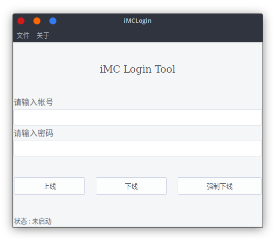
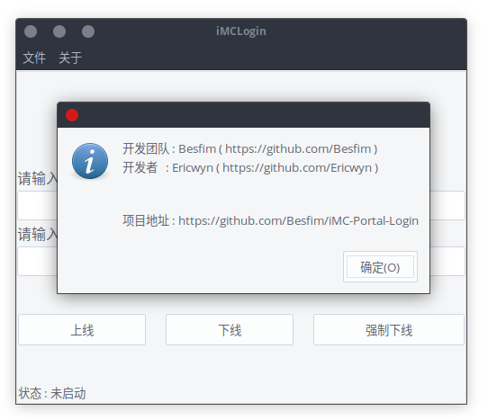

# iMC-Portal-Login
适用于 GDPU 的 iMC Portal 无线网络登录工具, 该分支完成了一个 GUI 界面

## 前言说明
学校之前开通了 iMC Portal 无线网络, 只是每次都要开启浏览器才可以登录, 并且需要一直开着一个标签, 这是件很麻烦的事情, 而且最近 (2018-07-11) 发现会出现每隔 15 分钟就断线一次的问题, 所以抓包来模拟登录, 并且在断线之后自动重连
 
 程序用 Golang 来编码所以可以方便的打包成二进制文件给各个平台使用

## 使用教程
### GUI 运行
直接点击程序即可运行

 - 输入帐号密码
 - 点击上线按钮上线
 - 点击下线按钮下线

### 命令行 运行

使用 -c 参数, 使得程序可以在命令行下运行， 更多参数如下

    -p string
        校园网密码 (default "null")
    -u string
        学生学号 (default "null")
    -d
        开启 DEBUG 日志打印
    -o 
        强制退出之前登录的帐号, 确保帐号已下线, 也要求输入正确的用户名和密码参数

## 其他说明
### 关于强制退出
如果在使用的过程中, 用户没有使用 exit 命令退出程序, 将导致帐号依然在线, 也无法在其他校园网终端登录帐号, 所以 iMCLogin 增加了一个强制退出帐号功能, 方便用户在程序不小心退出之后可以确保帐号已下线

调用该功能的时候, 将首先实行一次登录, 如果之前的帐号仍然在线, 那么此次登录将无法成功, 而服务器返回 json 当中将包含 

 > "portServErrorCodeDesc":"设备拒绝请求"
    
此时之前的帐号就已经下线了, 有点类被强行挤下线

而如果此次登录可以成功的话, 那么就正常调用 logout() 方法, 向下线接口 POST 相应数据

如此一来就能确保用户确实下线了
